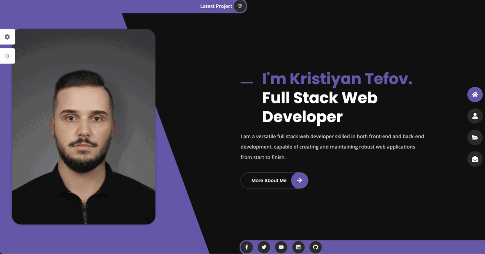

[](https://choosealicense.com/licenses/mit)

# Personal Portfolio



#

## Table of Contents

* [Description](#description)
* [Installation](#installation)
* [Usage](#usage)
* [Link](#link)
* [Authors](#authors)
* [License](#license)
#
## Description

I have created this sleek and dynamic website using the power of React to showcase my skills, experiences, and accomplishments. With a focus on delivering a seamless user experience, my portfolio website is designed to impress and engage visitors from the moment they arrive.

Key Features of My React-Powered Portfolio Website:

Eye-Catching Design: My portfolio website combines clean and modern aesthetics with visually striking elements to create a captivating first impression. Through careful attention to typography, color schemes, and layout, I have crafted a visually appealing platform that reflects my personal brand.

Responsive and Mobile-Friendly: Ensuring accessibility across devices, my portfolio website is fully responsive and optimized for a seamless experience on smartphones, tablets, and desktops. Visitors can easily explore my work and achievements, regardless of the device they are using.

Interactive Experience: Using React's powerful component-based architecture, I have incorporated interactive elements to enhance engagement. From smooth transitions to dynamic content loading, visitors can navigate through my portfolio effortlessly and explore different sections with ease.

Showcase of Skills and Projects: My portfolio website serves as a comprehensive repository of my skills, expertise, and past projects. I have curated a collection of my best work, highlighting my proficiency in various technologies, programming languages, and creative endeavors.

Contact and Collaboration: Connecting with me has never been easier. My portfolio website features a dedicated contact section, allowing visitors to reach out and discuss potential collaboration opportunities, job offers, or simply to say hello. I'm always excited to connect with fellow professionals and explore new possibilities.

Experience the Power of React in Action:

By leveraging the flexibility and robustness of React, I have crafted a personal portfolio website that not only showcases my abilities but also demonstrates my commitment to delivering exceptional user experiences. Explore my website and get in touch to embark on a journey of innovation and collaboration. Let's create something remarkable together!
#
## Installation

You can clone the git repository and run next command to use tha web application locally

Install all dependencies

```
  npm install
```

Start the web application

```
  npm run dev
```

#
## Usage
In order to use the web application you will need to visit the link to the website or clone the repository from GitHub provided in the link below.

#
## How to Contribute
For suggestions or contributions you can reach me at my email address or you can clone to code and edit it the way it will suite you the best.
#
## Link
Link to repository:

https://github.com/kristiyantefov/Portfolio


Link to website:


https://kristiyantefov.github.io/kris-web-dev/
#
## Authors

- [GitHub - Kristiyan Tefov](https://github.com/kristiyantefov)


#
## License

- This application is covered under: [MIT License](https://choosealicense.com/licenses/mit)

